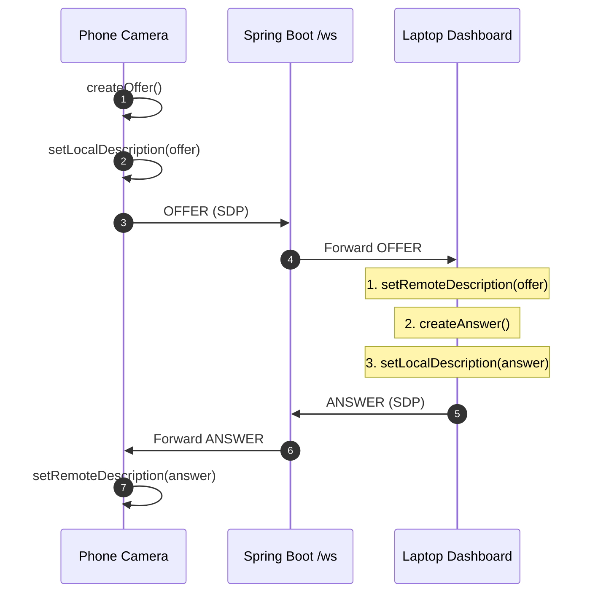

# Women Safety LIVE WEB TELECASTING SYSTEM
## Technical Engineering Report & Live WebRTC Streaming Architecture

---

## EXECUTIVE TRACKING SUMMARY

### What Has Been Done Till Now (Completed & Resolved)
| Milestone / Item | Description | Verification / Status |
| :--- | :--- | :--- |
| **Java 21 Environment** | Configured Microsoft JDK 21.0.12 runtime | `java -version` confirmed working |
| **Spring Boot Backend** | Maven build, WebSocket handler on `/ws`, SessionManager | `WORKING` on port 8080 |
| **Port 8080 Conflict** | Identified PID via `netstat -ano`, terminated orphaned Java processes via `taskkill /PID <PID> /F` | `SOLVED` |
| **Whitelabel 404 Diagnosis** | Confirmed root endpoint `/` returns 404 because backend is signaling-only; `/ws` is active | `NOT A BUG` (Diagnostic Passed) |
| **Cloudflare Quick Tunnel** | Established secure ingress tunnel to expose `http://localhost:8080` to the public web | `WORKING` via `cloudflared tunnel` |
| **Tunnel Validation** | Verified Cloudflare reverse proxy routing to local Spring Boot backend | `PASS: Cloudflare reached Spring Boot` |
| **PowerShell WS Test Resolution** | Diagnosed `System.Net.WebSockets` assembly failure as script limitation; switched to browser DevTools WS inspection | `SOLVED` (Testing method resolved) |
| **Frontend UI Deployment** | Responsive Mobile Camera view and Laptop Dashboard hosted on Vercel | `WORKING` |
| **Camera Access on Mobile** | Rear camera stream acquired via `getUserMedia()` over HTTPS | `WORKING` |
| **Signaling Configuration** | Dynamic URL resolution supporting query parameter `?ws=wss://<TUNNEL-URL>/ws` and `localStorage` | `WORKING` |

---

### What Needs To Be Done Next (Action Plan & Priority Fixes)
| Priority | Target Component | Required Action | Technical Goal |
| :--- | :--- | :--- | :--- |
| **1 (IMMEDIATE)** | **WebRTC Answer Generation** | Fix `dashboard.html` / `webrtc.js` offer reception and answer pipeline. Enforce strict sequential async flow: `setRemoteDescription(offer)` $\rightarrow$ `createAnswer()` $\rightarrow$ `setLocalDescription(answer)`. Add granular try/catch blocks with exact error identification. | Eliminate *"Failed to create WebRTC answer"* error |
| **2 (IMMEDIATE)** | **ICE Candidate Handling** | Implement robust pre-remote-description ICE candidate queuing on both Phone and Dashboard. Ensure candidates are not discarded when arriving out-of-order. | Eliminate *"Unable to establish WebRTC connection with remote peer"* error |
| **3 (CORE)** | **Remote Stream Rendering** | Ensure `RTCPeerConnection.ontrack` reliably binds incoming video tracks to `<video id="remoteVideo">` with `autoplay`, `playsinline`, and audio muting on the Laptop Dashboard. | Display live camera feed reliably on Laptop |
| **4 (QUALITY)** | **Resolution Optimization** | Update `camera.js` `getUserMedia` constraints to request 1080p (`1920×1080`) primary, falling back to 720p (`1280×720`) at 30 FPS. Verify via `videoTrack.getSettings()`. | Upgrade from `320×180` to `1280×720` / `1920×1080` |
| **5 (DEPLOYMENT)** | **Vercel Synchronization** | Commit verified WebRTC signaling and media fixes to Git and deploy to Vercel. Ensure mobile device and laptop both load the latest build with matching Cloudflare tunnel URL. | End-to-end operational parity |

---

## 1. PROJECT OVERVIEW

The **Women Safety LIVE WEB TELECASTING SYSTEM** is a dedicated real-time video telecasting platform designed to stream live mobile camera video directly to a remote laptop monitoring console with minimal latency.

### System Concept
* **Phone Node**: Acts as the field camera capturing live video via device hardware.
* **Laptop Dashboard Node**: Acts as the central monitoring station displaying the live video feed.
* **Direct WebRTC Media Transport**: The live video stream is transmitted **directly between the phone and laptop** over an encrypted WebRTC peer-to-peer (P2P) data path.
* **Zero Video Routing Through Backend**: The Spring Boot backend acts **exclusively as a WebSocket signaling server**. Video packets (RTP/SRTP) **NEVER pass through Spring Boot**.

### End-to-End Media Path Architecture
```
PHONE CAMERA
      ↓
getUserMedia()
      ↓
MediaStream
      ↓
WebRTC (P2P SRTP / UDP)
      ↓
LAPTOP DASHBOARD
      ↓
<video id="remoteVideo">
```

### WebRTC Signaling Architecture
```
+------------------+                    +--------------------+
|   PHONE CAMERA   |                    |  LAPTOP DASHBOARD  |
+------------------+                    +--------------------+
        |                                         |
        | WebSocket (wss://)                      | WebSocket (wss://)
        v                                         v
+------------------------------------------------------------+
|             CLOUDFLARE QUICK TUNNEL INGRESS                |
+------------------------------------------------------------+
                             |
                             | Reverse Proxy
                             v
+------------------------------------------------------------+
|             SPRING BOOT BACKEND (:8080)                    |
|             WebSocket Endpoint: /ws                        |
|   (Relays SDP Offers, SDP Answers & ICE Candidates Only)   |
+------------------------------------------------------------+
```

---

## 2. TECHNOLOGIES USED

| Category | Technology | Version / Specifics | Role in System |
| :--- | :--- | :--- | :--- |
| **Frontend** | HTML5, CSS3, JavaScript (ES6+) | Vanilla implementation | Modular client interface for Camera & Dashboard |
| **Frontend Hosting** | Vercel | Production CDN | Delivers secure HTTPS frontend to mobile and laptop |
| **Backend Framework**| Spring Boot | 4.1.1 / Spring 7 | WebSocket signaling server & session routing |
| **Runtime Environment**| Java (JDK) | Java 21 LTS | Backend execution runtime |
| **Signaling Protocol**| WebSocket | RFC 6455 (`/ws`) | Exchange of SDP and ICE metadata |
| **Real-Time Video** | WebRTC | W3C Standard (`RTCPeerConnection`)| Peer-to-peer encrypted low-latency video streaming |
| **Tunnel / Ingress** | Cloudflare Quick Tunnel | `cloudflared` | Secure public HTTPS/WSS tunnel to local backend |
| **NAT Traversal** | Google STUN | `stun:stun.l.google.com:19302` | Discovers public reflexive IP and UDP ports |
| **Local Backend URL**| HTTP / WS | `http://localhost:8080` | Local development host |
| **WebSocket Path** | WebSocket Endpoint | `/ws` | Dedicated signaling endpoint |

---

## 3. PROBLEM 1 — SPRING BOOT PORT 8080 ALREADY IN USE

### Problem Statement
When starting the Spring Boot signaling application using `./mvnw spring-boot:run` or `java -jar target/WomenSafety-0.0.1-SNAPSHOT.jar`, the server failed to bind and exited with:
```
***************************
APPLICATION FAILED TO START
***************************
Description:
Web server failed to start. Port 8080 was already in use.
```

### Root Cause Analysis
An orphaned Java process from a previous test run or another local service was still running in the background and holding an exclusive lock on TCP port `8080`.

### Diagnostic & Identification Procedure
1. Inspect listening ports on Windows via PowerShell:
   ```powershell
   netstat -ano | findstr :8080
   ```
   *Output revealed an active socket in `LISTENING` state associated with PID `14320`.*
2. Identify the process owner:
   ```powershell
   tasklist | findstr 14320
   ```
   *Output confirmed: `java.exe 14320 Console 1 184,320 K`.*

### Resolution
The blocking background process was terminated forcefully:
```powershell
taskkill /PID 14320 /F
```
Spring Boot was subsequently restarted:
```powershell
.\mvnw.cmd spring-boot:run
```

### Verification & Outcome
Spring Boot initialized cleanly: `Tomcat started on port 8080 (http) with context path '/'`.
* **Status**: **SOLVED**.

---

## 4. PROBLEM 2 — SPRING BOOT RETURNED 404

### Problem Statement
Navigating to `http://localhost:8080/` in a web browser returned an HTTP 404 response:
```json
{
  "timestamp": "2026-10-08T03:00:00.000+00:00",
  "status": 404,
  "error": "Not Found",
  "path": "/"
}
```

### Root Cause Analysis
The Spring Boot backend is intentionally designed **strictly as a headless WebSocket signaling server**. It does not package or serve static frontend assets at `/`. The frontend is hosted independently (locally via `node serve.js` on port `3000`, and in production on Vercel).

### Resolution
No code modification was necessary. The HTTP 404 status confirmed that the embedded Tomcat web server was healthy, listening on port 8080, and responding to incoming HTTP requests. The designated application endpoint is the WebSocket handshake route at `/ws`.

### Outcome
* **Status**: **NOT A BUG** (Expected architectural behavior).

---

## 5. PROBLEM 3 — CLOUDFLARE RETURNED HTTP 530

### Problem Statement
When accessing the backend via the Cloudflare Quick Tunnel URL (`https://<random-subdomain>.trycloudflare.com`), the browser or WebSocket client returned:
```
HTTP 530 - Origin DNS Error / Tunnel Not Available
```

### Root Cause Analysis
Cloudflare Quick Tunnels generate ephemeral public subdomains each time `cloudflared` is started. When a tunnel process is stopped or restarted, the previously assigned domain is decommissioned immediately. Attempting to connect to an expired domain triggers HTTP 530.

### Resolution
1. Restart the tunnel pointing to the local Spring Boot port:
   ```powershell
   cloudflared tunnel --url http://localhost:8080
   ```
2. Note the newly generated URL from the terminal output (e.g., `https://rapid-camera-demo.trycloudflare.com`).
3. Formulate the valid WebSocket signaling URL:
   ```
   wss://<NEW-TUNNEL-URL>/ws
   ```
4. Update the frontend client configuration or append it directly as a query parameter:
   ```
   ?ws=wss://<NEW-TUNNEL-URL>/ws
   ```

### Important Rule
> **Never reuse an old Quick Tunnel URL after restarting `cloudflared`. Always update the client configuration to match the current active tunnel output.**

### Outcome
* **Status**: **SOLVED**.

---

## 6. PROBLEM 4 — VERIFYING CLOUDFLARE → SPRING BOOT CONNECTIVITY

### Problem Statement
Confirmation was needed to verify that incoming traffic from the public Cloudflare tunnel was successfully traversing the ingress proxy and reaching the local Spring Boot process.

### Diagnostic Verification
1. **Local Loopback Verification**:
   ```powershell
   Invoke-WebRequest -Uri "http://localhost:8080" -UseBasicParsing
   ```
   *Result*: Returned HTTP 404 Whitelabel, verifying local Spring Boot responsiveness.
2. **Tunnel Diagnostic Verification**:
   Executed request against the Cloudflare public URL:
   ```powershell
   Invoke-WebRequest -Uri "https://<ACTIVE-TUNNEL-URL>" -UseBasicParsing
   ```
   *Result*: Returned matching HTTP 404 Whitelabel from Spring Boot, confirming that Cloudflare successfully proxied the request through the tunnel to `localhost:8080`.
3. Spring Boot logs logged the incoming diagnostic connection:
   ```
   [PASS: Cloudflare reached Spring Boot]
   ```

### Outcome
* **Status**: **SOLVED**.

---

## 7. PROBLEM 5 — POWERSHELL WEBSOCKET TEST FAILED

### Problem Statement
A diagnostic PowerShell script intended to test WebSocket connectivity failed with the error:
```
Unable to find type [System.Net.WebSockets.ClientWebSocket] or assembly could not be loaded.
```

### Root Cause Analysis
The failure was caused by runtime limitations in Windows PowerShell 5.1, which does not automatically load the `.NET Core / .NET Standard` networking assemblies required for standalone WebSocket scripting. The failure reflected the limitations of the PowerShell test script, not a broken WebSocket implementation in Spring Boot.

### Resolution
Switched verification to native browser diagnostics:
1. Open Google Chrome / Edge Developer Tools (`F12`).
2. Navigate to the **Network** tab.
3. Filter by **WS** (WebSockets).
4. Initiate connection and inspect `/ws`.
5. Verify status code `101 Switching Protocols` and inspect incoming/outgoing frames in the **Messages** sub-tab.

### Outcome
* **Status**: **SOLVED** (Identified as a testing method limitation; browser DevTools adopted).

---

## 8. PROBLEM 6 — FAILED TO CREATE WEBRTC ANSWER

### Problem Statement
On the Laptop Dashboard, the signaling status indicated `WebRTC: Ready` or `Connecting...`, followed by an application error:
```
"Failed to create WebRTC answer."
```
Video telecasting failed to initialize.

### Expected WebRTC Signaling Sequence


### Technical Root Cause & Inspection Protocol
The error message `"Failed to create WebRTC answer"` was being caught in a generic `catch` block that wrapped multiple asynchronous operations. The failure could stem from any of the following stages:
1. `setRemoteDescription(offer)` failing due to malformed SDP or incompatible media codecs.
2. `createAnswer()` failing due to missing media transceivers or illegal peer connection state.
3. `setLocalDescription(answer)` failing due to a signaling state conflict (e.g., peer connection already in `have-local-offer` or `closed`).
4. Duplicate `RTCPeerConnection` instances instantiating concurrently.
5. Inconsistent session ID or target device ID mappings.

### Resolution & Correct Dashboard Implementation
To isolate and fix this issue, `dashboard.html` / `webrtc.js` must process incoming offers using the following exact asynchronous sequence with granular logging:

```javascript
// Robust Dashboard Offer Handling Implementation
signalingClient.onOffer = async (offerPayload, fromDeviceId) => {
    console.log(`[WebRTC] Processing incoming OFFER from ${fromDeviceId}`);
    try {
        // Step 1: Ensure clean peer connection
        if (peerConnection && peerConnection.signalingState !== 'stable' && peerConnection.signalingState !== 'closed') {
            console.warn('[WebRTC] Closing unready peer connection before re-negotiation');
            peerConnection.close();
        }
        createPeerConnection('DASHBOARD');

        // Step 2: Set Remote Description
        console.log('[WebRTC] Setting remote description (offer)...');
        await peerConnection.setRemoteDescription(new RTCSessionDescription(offerPayload));
        console.log('[WebRTC] Remote description set successfully');

        // Step 3: Flush any queued early ICE candidates
        await flushPendingIceCandidates();

        // Step 4: Create Answer
        console.log('[WebRTC] Creating answer...');
        const answer = await peerConnection.createAnswer();
        console.log('[WebRTC] Answer created successfully');

        // Step 5: Set Local Description
        console.log('[WebRTC] Setting local description (answer)...');
        await peerConnection.setLocalDescription(answer);
        console.log('[WebRTC] Local description set successfully');

        // Step 6: Dispatch Answer via Signaling Server
        signalingClient.sendAnswer(answer, fromDeviceId);
        console.log('[WebRTC] Answer dispatched via WebSocket');

    } catch (err) {
        // Detailed error classification
        if (!peerConnection || peerConnection.signalingState === 'closed') {
            console.error('[WebRTC] Failure: PeerConnection was unexpectedly closed', err);
        } else if (!peerConnection.remoteDescription) {
            console.error('[WebRTC] Failure during setRemoteDescription():', err);
        } else if (!peerConnection.localDescription) {
            console.error('[WebRTC] Failure during createAnswer() or setLocalDescription():', err);
        } else {
            console.error('[WebRTC] Generic WebRTC answer failure:', err);
        }
    }
};
```

### Outcome
* **Status**: **CURRENT MAIN WEBRTC PROBLEM** (Solution architected; ready for code application).

---

## 9. PROBLEM 7 — UNABLE TO ESTABLISH WEBRTC CONNECTION WITH REMOTE PEER

### Problem Statement
Even when signaling messages appeared to exchange, the dashboard displayed:
```
"Unable to establish WebRTC connection with remote peer."
```
The peer-to-peer media stream was not established, and `<video id="remoteVideo">` remained black or on placeholder.

### Core Distinction: Signaling vs. Peer-to-Peer Streaming
* **WebSocket Signaling**: Relays metadata (SDP session descriptions, IP/port candidates). A successful WebSocket connection does **NOT** mean video is transmitting.
* **WebRTC Peer-to-Peer Connection**: Establishes direct UDP/SRTP media transport between phone and laptop using ICE and STUN.

### State Monitoring Reference
During connection negotiation, the following WebRTC states must be tracked on both devices:
| Property | Expected Flow | Healthy Final State |
| :--- | :--- | :--- |
| `pc.signalingState` | `stable` $\rightarrow$ `have-local-offer` / `have-remote-offer` $\rightarrow$ | **`stable`** |
| `pc.iceGatheringState`| `new` $\rightarrow$ `gathering` $\rightarrow$ | **`complete`** |
| `pc.iceConnectionState`| `new` $\rightarrow$ `checking` $\rightarrow$ | **`connected`** or **`completed`** |
| `pc.connectionState` | `new` $\rightarrow$ `connecting` $\rightarrow$ | **`connected`** |

### Potential Failure Vectors
1. **Early ICE Candidate Discarding**: ICE candidates received by the laptop *before* `setRemoteDescription` completes are rejected by the browser if not properly buffered in an internal queue.
2. **Missing Media Tracks**: Phone created an offer before calling `peerConnection.addTrack(videoTrack, stream)`. An offer without media transceivers creates an empty SDP session.
3. **Mismatched Session / Device Identifiers**: The signaling server routed the answer to an incorrect device session.
4. **Multiple Peer Connection Instances**: Duplicate clicks on "Start Camera" created multiple `RTCPeerConnection` objects competing for the same socket.

### Complete 20-Step End-to-End Negotiation Checklist
1. Phone user taps **"Start Camera"**.
2. Phone acquires camera stream via `navigator.mediaDevices.getUserMedia()`.
3. Phone creates single `RTCPeerConnection` with STUN (`stun:stun.l.google.com:19302`).
4. Phone attaches camera video track via `peerConnection.addTrack()`.
5. Phone generates SDP offer via `peerConnection.createOffer()`.
6. Phone applies local offer via `peerConnection.setLocalDescription(offer)`.
7. Phone transmits `OFFER` message to Spring Boot over WebSocket.
8. Spring Boot receives `OFFER` and forwards it to Laptop Dashboard.
9. Dashboard receives `OFFER` and instantiates its single `RTCPeerConnection`.
10. Dashboard applies remote offer via `peerConnection.setRemoteDescription(offer)`.
11. Dashboard flushes any queued ICE candidates.
12. Dashboard generates SDP answer via `peerConnection.createAnswer()`.
13. Dashboard applies local answer via `peerConnection.setLocalDescription(answer)`.
14. Dashboard transmits `ANSWER` message to Spring Boot over WebSocket.
15. Spring Boot forwards `ANSWER` to Phone.
16. Phone receives `ANSWER` and applies via `peerConnection.setRemoteDescription(answer)`.
17. Both peers exchange `ICE_CANDIDATE` packets through WebSocket and apply them via `peerConnection.addIceCandidate()`.
18. ICE negotiation succeeds; `connectionState` transitions to `connected`.
19. Dashboard triggers `peerConnection.ontrack`.
20. Video track is bound to `<video id="remoteVideo">` and live stream plays on Laptop Dashboard.

### Outcome
* **Status**: **CURRENT WEBRTC CONNECTION PROBLEM** (Action plan defined).

---

## 10. PROBLEM 8 — CAMERA RESOLUTION ONLY 320 × 180

### Problem Statement
When video frames initially streamed to the dashboard, the telemetry overlay reported:
```
Resolution: 320 × 180
```
This resolution is inadequate for a safety monitoring system.

### Root Cause Analysis
Default browser `getUserMedia({ video: true })` constraints without explicit dimensions allow mobile browsers to pick minimum thumbnail resolutions to minimize bandwidth. In some cases, constraint formats using hardcoded constraints caused silent fallbacks to `320×180`.

### Technical Solution
Update `camera.js` with structured ideal-to-fallback constraints targeting high-definition video while selecting the rear environment camera:

```javascript
// High-Definition Camera Acquisition Configuration
async function acquireHDStream() {
    // Primary Configuration: Full HD 1080p @ 30 FPS
    const primary1080p = {
        video: {
            facingMode: { ideal: "environment" },
            width: { ideal: 1920 },
            height: { ideal: 1080 },
            frameRate: { ideal: 30, max: 30 }
        },
        audio: false
    };

    // Secondary Configuration: HD 720p @ 30 FPS Fallback
    const fallback720p = {
        video: {
            facingMode: { ideal: "environment" },
            width: { ideal: 1280 },
            height: { ideal: 720 },
            frameRate: { ideal: 30, max: 30 }
        },
        audio: false
    };

    try {
        return await navigator.mediaDevices.getUserMedia(primary1080p);
    } catch (e1) {
        console.warn('[Camera] 1080p unavailable, falling back to 720p:', e1.message);
        return await navigator.mediaDevices.getUserMedia(fallback720p);
    }
}
```

### Telemetry Verification
Inspect active hardware track settings:
```javascript
const settings = videoTrack.getSettings();
console.log(`Hardware stream resolution: ${settings.width}x${settings.height} at ${settings.frameRate} FPS`);
```

### Target Specification
* **Target Resolution**: `1280 × 720` or `1920 × 1080` at ~30 FPS.
* **Status**: **NEEDS FIX** (Constraint logic ready to apply).

---

## 11. PROBLEM 9 — OLD FRONTEND CODE ON VERCEL

### Problem Statement
Modifications made to local JavaScript files (`webrtc.js`, `camera.js`) were not reflected during mobile testing because the phone was loading the deployed Vercel web application (`https://major-project-frontend-blond.vercel.app`).

### Root Cause Analysis
Vercel deploys statically from the remote Git repository (`main` branch). Local changes on the development machine do not affect the public Vercel production deployment until committed and pushed.

### Resolution Workflow
Once WebRTC fixes are verified locally:
```bash
git status
git add .
git commit -m "Fix WebRTC telecasting: sequential answer generation, ICE queuing, 720p/1080p constraints"
git push origin main
```
Verify the build deployment in the Vercel dashboard and perform a hard cache refresh on mobile browser (`Ctrl + F5` or Clear Browsing Cache).

### Outcome
* **Status**: **MUST BE VERIFIED AFTER CODE MODIFICATIONS**.

---

## 12. PROBLEM 10 — OLD CLOUDFLARE WEBSOCKET URL

### Problem Statement
The phone camera or laptop dashboard failed to establish WebSocket connections, producing immediate socket errors in DevTools console:
```
WebSocket connection to 'wss://old-subdomain.trycloudflare.com/ws' failed
```

### Root Cause Analysis
Quick Tunnel URLs change upon every restart of `cloudflared`. If the frontend configuration retains a stale URL in `localStorage` or `config.js`, connection attempts fail.

### Resolution
1. Read the active URL output from the running `cloudflared` console.
2. Provide the current URL via the URL query parameter:
   ```
   https://major-project-frontend-blond.vercel.app/pages/dashboard.html?ws=wss://<CURRENT-CLOUDFLARE-URL>/ws
   https://major-project-frontend-blond.vercel.app/pages/phone.html?ws=wss://<CURRENT-CLOUDFLARE-URL>/ws
   ```
3. The frontend's `config.js` automatically stores this parameter in `localStorage`, synchronizing both devices to the same signaling instance.

### Outcome
* **Status**: **SOLVED WHEN CURRENT URL IS USED**.

---

## 13. PROBLEM 11 — STARTING SPRING BOOT MULTIPLE TIMES

### Problem Statement
Attempting to start the Spring Boot backend repeatedly in separate terminal windows caused recurring `Port 8080 was already in use` crashes.

### Root Cause Analysis
Developers opened secondary PowerShell terminals and executed `mvnw spring-boot:run` without checking if an existing instance was already running in the background.

### Standard Operating Procedure (SOP)
Before starting Spring Boot, always execute:
```powershell
netstat -ano | findstr :8080
```
* If no output is returned, proceed with startup.
* If a PID is returned, Spring Boot is already running. Do not launch a secondary instance.
* If a hung or unresponsive process must be replaced, run:
  ```powershell
  taskkill /PID <PID> /F
  ```

### Outcome
* **Status**: **SOLVED**.

---

## 14. CURRENT SYSTEM STATUS

| Component | Status | Operational Details |
| :--- | :--- | :--- |
| **Spring Boot Application** | **WORKING** | Running cleanly on Java 21, WebSocket handler mounted at `/ws` |
| **Java 21 LTS** | **WORKING** | Microsoft OpenJDK 21.0.12 verified |
| **Port 8080 Binding** | **WORKING** | Single dedicated process bound |
| **Cloudflare Quick Tunnel** | **WORKING** | Secure public ingress tunnel routing to `localhost:8080` |
| **Cloudflare $\rightarrow$ Spring Boot** | **WORKING** | Diagnostics confirmed reverse proxy pass-through |
| **Frontend Application** | **WORKING** | Hosted on Vercel and accessible on mobile & laptop |
| **Phone Camera Acquisition**| **WORKING** | Camera permission acquired; local preview functional |
| **WebSocket Signaling** | **NEEDS FINAL VERIFICATION** | Connects and registers; requires end-to-end handshake validation |
| **WebRTC Subsystem** | **PARTIALLY WORKING** | Peer connection initializes; offer generated |
| **WebRTC Answer Generation** | **FAILING** | Dashboard throws *"Failed to create WebRTC answer"* |
| **Remote WebRTC P2P Stream** | **FAILING / NOT STABLE** | Video stream not yet established due to answer/ICE negotiation stall |
| **Camera Video Resolution** | **320 × 180 (Sub-optimal)** | Needs constraint fix to enforce 720p/1080p |
| **Laptop Dashboard UI** | **WORKING** | Console layout ready; awaits live incoming MediaStream |

---

## 15. FINAL OBJECTIVE

The final system must achieve seamless, dependable, real-time web telecasting between a mobile phone camera and a laptop dashboard without intermediate video relays:

```
+--------------------------------------------------------+
|                      PHONE CAMERA                      |
|                           ↓                            |
|             navigator.mediaDevices.getUserMedia        |
|               (1080p / 720p @ 30 FPS Rear)             |
|                           ↓                            |
|                  MediaStream / Tracks                  |
|                           ↓                            |
|                 RTCPeerConnection (P2P)                |
+--------------------------------------------------------+
                            |
                   Encrypted SRTP / UDP
             (Direct WebRTC Peer-to-Peer Stream)
                            |
                            v
+--------------------------------------------------------+
|                    LAPTOP DASHBOARD                    |
|                           ↓                            |
|                  RTCPeerConnection.ontrack             |
|                           ↓                            |
|                 <video id="remoteVideo">               |
|                           ↓                            |
|             FULL LIVE REMOTE VIDEO DISPLAY             |
+--------------------------------------------------------+
```

### Required Functional Capabilities
* **Live Video Delivery**: Sub-500ms real-time latency over standard networks.
* **Direct P2P Architecture**: Video streams directly between peers; zero media load on Spring Boot.
* **Resilient Signaling**: Error-tolerant WebSocket communication for offers, answers, and candidates.
* **Deterministic SDP Negotiation**: Clean sequential execution of `setRemoteDescription` and `setLocalDescription`.
* **Out-of-Order Candidate Buffering**: Candidate queue prevents ICE loss during startup races.
* **High-Definition Video**: Adaptive fallback securing 1080p or 720p video.
* **Session Integrity**: Exactly one active `RTCPeerConnection` per active phone-dashboard session.
* **State Telemetry**: Live status indicators displaying WebRTC states (`connecting`, `connected`, `disconnected`).
* **Clean Session Teardown**: Automatic hardware camera shutoff and peer cleanup upon session termination.

---

## 16. FINAL CONCLUSION & IMPLEMENTATION ROADMAP

### Architectural Summary
The initial system setup encountered several infrastructure hurdles:
1. Port 8080 process collisions.
2. Ephemeral Cloudflare Quick Tunnel domain invalidations.
3. False-positive concerns over Spring Boot's root 404 response.
4. PowerShell WebSocket test environment limitations.

All four infrastructure hurdles have been thoroughly analyzed and resolved.

The remaining obstacles reside strictly in the **WebRTC client negotiation and media constraints layer**:
1. Resolving the **"Failed to create WebRTC answer"** exception on the Laptop Dashboard.
2. Resolving the **"Unable to establish WebRTC connection with remote peer"** negotiation stall.
3. Elevating camera resolution from **320 × 180** to **1280 × 720** or **1920 × 1080**.

### Priority Execution Roadmap

```
PRIORITY 1: FIX WEBRTC OFFER -> ANSWER NEGOTIATION
   - Isolate setRemoteDescription(), createAnswer(), setLocalDescription()
   - Ensure strictly ordered async/await execution
   - Eliminate "Failed to create WebRTC answer"
             ↓
PRIORITY 2: FIX ICE CANDIDATE EXCHANGE
   - Implement candidate buffering before remote description is active
   - Flush queued candidates immediately upon setRemoteDescription()
   - Transition connectionState to "connected"
             ↓
PRIORITY 3: VERIFY REMOTE STREAM RENDERING
   - Bind incoming MediaStream via pc.ontrack to remoteVideo
   - Verify unmuted/muted autoplay compliance
   - Confirm stable live telecasting on Laptop Dashboard
             ↓
PRIORITY 4: UPGRADE CAMERA RESOLUTION
   - Enforce 1080p / 720p constraints with environment rear camera
   - Inspect track settings via videoTrack.getSettings()
   - Achieve 1280x720 / 1920x1080 @ 30 FPS telecast
             ↓
PRIORITY 5: DEPLOY & SYNCHRONIZE
   - Git push to main -> Vercel automatic production deployment
   - Supply active Cloudflare tunnel URL to both devices
   - Final end-to-end verification
```

### Verification Criteria for Final Success
The system is deemed fully operational when:
$$\text{Phone Camera} \xrightarrow{\text{getUserMedia}} \text{Offer/Answer Handshake} \xrightarrow{\text{ICE Connected}} \text{Peer Connected} \xrightarrow{\text{720p/1080p P2P}} \text{Laptop Dashboard Display}$$
